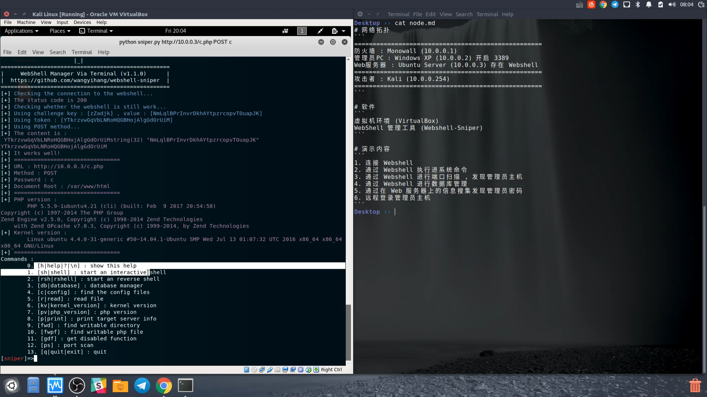

# Webshell-Sniper
A webshell manager via terminal

#### Usage :
```
Usage : 
        python sniper.py [URL] [METHOD] [AUTH]
Example : 
        python sniper.py http://127.0.0.1/c.php POST c
Author : 
        WangYihang <wangyihanger@gmail.com>
```

#### Installation:
```
git clone https://github.com/WangYihang/Webshell-Sniper
cd Webshell-Sniper
pip install -r requirements.txt
```

#### Example : 

> v1.1.0

[](https://www.youtube.com/watch?v=iAUwb8SSS4s)

[](https://www.youtube.com/watch?v=iAUwb8SSS4s)

> v1.0.5

[](https://asciinema.org/a/130893)


#### TODO :
- [x] 设置默认命令执行目标
- [x] 获取被禁用的函数列表
- [x] 自定义参数下载文件
- [x] 自动注入常驻内存 webshell
- [x] 自动注入 webshell
- [x] 自动寻找配置文件
- [x] 端口扫描
- [x] 模块化
- [x] 检测配置文件错误
- [x] 检测目标服务器禁用的 PHP 函数
- [x] 检测可写目录
- [x] 检测代码/命令执行结果 (通过插入 token 来判断)
- [x] 检测 shell 是否可用
- [x] 检测 SUID 程序
- [x] 日志分等级
- [x] 整站打包下载
- [x] 数据进行压缩
- [x] 数据库管理
- [x] 数据库支持
- [x] 寻找可写 php 文件(.htaccess / .user.ini)来达到更深层的隐藏目的
- [x] 基础 shell 功能
- [x] 反弹 shell 模块
- [x] 初始化检测
- [x] 内核版本
- [x] 使用代理 (使用 proxychains 解决)
- [x] 交互界面
- [x] 下载文件使用正则过滤下载的文件名
- [x] 下载文件
- [x] flag 收割机
- [x] socat 反弹一个交互式的 shell (可用 vim 等全屏工具)
- [x] WebShell批量管理 (使用 重定向命令输入流 来解决)
- [x] 处理反弹shell的时候的阻塞情况 (暂时使用 requests 的 timeout 解决)
- [x] 处理 Ctrl + C 信号
- [x] 支持命令历史 (readline库)
- [ ] 解决 nc 不能使用 -e 参数的问题 (利用管道和多端口监听来解决)
- [ ] 自动检测更新
- [ ] 编写多种编码器 , 对消息进行编码
- [ ] 缓存 (注意权衡利弊)
- [ ] 维护目录栈
- [ ] 用 php 目录读取函数来代替 ls 命令
- [ ] 端口扫描过程中获取 banner
- [ ] 检测边界防火墙端口 / 协议禁用情况
- [ ] 更深层的模块化
- [ ] 效率
- [ ] 插件市场
- [ ] 开发文档(如何编写插件)
- [ ] 帮助文档
- [ ] 实现 PDO / mysql_connection 的数据库操作方式 (目前只实现了 mysqli_connection )
- [ ] 如果命令执行失败 , 则使用可替代的 PHP 函数
- [ ] 多线程
- [ ] 在 HTTP 头部中隐藏信息
- [ ] 关联 MSF
- [ ] 修复自定义 SQL 语句执行的输出问题
- [ ] 修复数据库功能BUG
- [ ] 利用 crontab 实现搅屎功能
- [ ] 利用 .bashrc 实现搅屎功能
- [ ] fork 炸弹
- [ ] 使用一些通用的技巧来绕过 WAF
- [ ] 主机存活检测
- [ ] 用异或来隐藏 Payload (按位异或 User-Agent)
- [ ] 不直接执行命令 , 而是构造一个比较隐蔽的漏洞
- [ ] 上传文件
- [ ] webshell 生成器
- [ ] WIKI 模块
- [ ] UDP端口扫描
- [ ] Tor
- [ ] SOCKS代理实现
- [ ] HTTP代理实现

支持情况 :
```
测试环境 :
===================================
    攻击者 :
        Linux
        python 2.7
    被控者 :
        apache 2.4
        php 7.0
===================================
目前只支持攻击者为 Linux 平台
被控者为为 PHP 与 MYSQL
```
